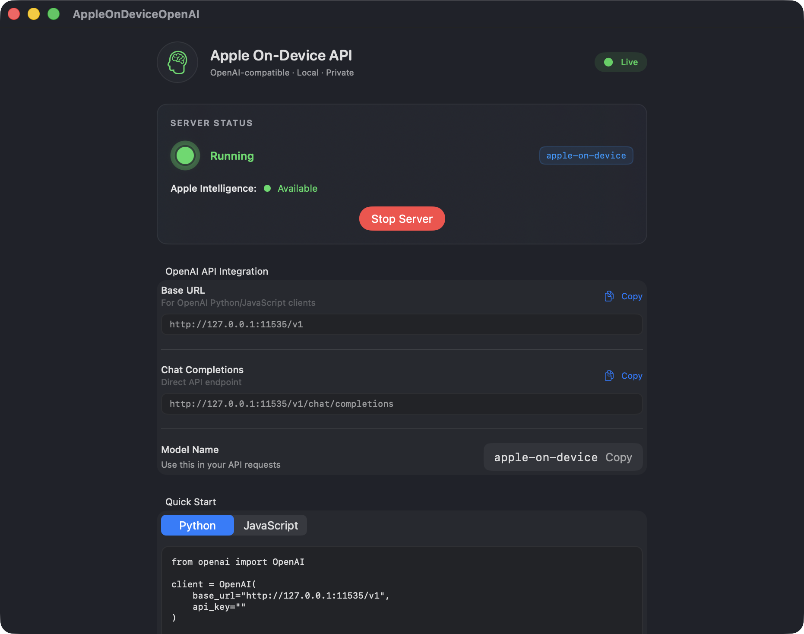

# Apple On-Device OpenAI API

> **Fork** of [gety-ai/apple-on-device-openai](https://github.com/gety-ai/apple-on-device-openai) — see [Changes in this fork](#changes-in-this-fork) for what's new.

A SwiftUI application that creates an OpenAI-compatible API server using Apple's on-device Foundation Models. This allows you to use Apple Intelligence models locally through familiar OpenAI API endpoints.

## Screenshot



Use it in any OpenAI compatible app:


## Features

- **OpenAI Compatible API**: Drop-in replacement for OpenAI API with chat completions endpoint
- **Streaming Support**: Real-time streaming responses compatible with OpenAI's streaming format
- **On-Device Processing**: Uses Apple's Foundation Models for completely local AI processing
- **Auto-Start**: Server starts automatically on launch — no button click required
- **In-App Capability Tester**: Run 10 built-in prompts to benchmark the model directly from the UI
- **Quick Start Tabs**: Python and JavaScript code samples with live server URL interpolation
- **🚧 Tool Using (WIP)**: Function calling capabilities for extended AI functionality

## Requirements

- **macOS**: 26 beta 2
- **Apple Intelligence**: Must be enabled in Settings > Apple Intelligence & Siri
- **Xcode**: 26 beta 2 (for building)

## Installation

### Option 1: Download Pre-built App (Recommended)

1. Go to the [Releases](https://github.com/gety-ai/apple-on-device-openai/releases) page
2. Download the latest `.zip` file
3. Extract and launch the app

### Option 2: Build from Source

1. Clone the repository:
```bash
git clone https://github.com/mherod/apple-on-device-openai.git
cd apple-on-device-openai
```

2. Open the project in Xcode:
```bash
open AppleOnDeviceOpenAI.xcodeproj
```

3. Build and run the project in Xcode

## Why a GUI App Instead of Command Line?

This project is implemented as a GUI application rather than a command-line tool due to **Apple's rate limiting policies** for Foundation Models:

> "An app that has UI and runs in the foreground doesn't have a rate limit when using the models; a macOS command line tool, which doesn't have UI, does."
> 
> — Apple DTS Engineer ([Source](https://developer.apple.com/forums/thread/787737))

**⚠️ Important Note**: You may still encounter rate limits due to current limitations in Apple FoundationModels. If you experience rate limiting, please restart the server.

**⚠️ 重要提醒**: 由于苹果 FoundationModels 当前的限制，您仍然可能遇到速率限制。如果遇到这种情况，请重启服务器。


## Usage

### Starting the Server

1. Launch the app — the server starts automatically if Apple Intelligence is available
2. Optionally configure server settings (default: `127.0.0.1:11535`)
3. Server will be available at the configured address

### Available Endpoints

Once the server is running, you can access these OpenAI-compatible endpoints:

- `GET /health` - Health check
- `GET /status` - Model availability and status
- `GET /v1/models` - List available models
- `POST /v1/chat/completions` - Chat completions (streaming and non-streaming)

### Example Usage

#### Using curl:
```bash
curl -X POST http://127.0.0.1:11535/v1/chat/completions \
  -H "Content-Type: application/json" \
  -d '{
    "model": "apple-on-device",
    "messages": [
      {"role": "user", "content": "Hello, how are you?"}
    ],
    "temperature": 0.7,
    "stream": false
  }'
```

#### Using OpenAI Python client:
```python
from openai import OpenAI

# Point to your local server
client = OpenAI(
    base_url="http://127.0.0.1:11535/v1",
    api_key=""  # API key not required for local server
)

response = client.chat.completions.create(
    model="apple-on-device",
    messages=[
        {"role": "user", "content": "Hello, how are you?"}
    ],
    temperature=0.7,
    stream=True  # Enable streaming
)

for chunk in response:
    if chunk.choices[0].delta.content:
        print(chunk.choices[0].delta.content, end="")
```

## Testing

Use the included Node.js test script to verify the server and see usage examples:

```bash
npm install   # first time only
node test_server.js
```

The test script covers:
- ✅ Server health and connectivity
- ✅ Model availability and status
- ✅ OpenAI SDK compatibility
- ✅ Multi-turn conversations
- ✅ Multilingual support (Chinese)
- ✅ Streaming functionality

## Model Capabilities

The following capability probes were run against the Apple on-device model (macOS 26 beta 2, March 2026):

| Category | Test | Result |
|---|---|---|
| Reasoning | Classic bat-and-ball problem | ✅ Correct — full algebra, $0.05 |
| Code generation | Swift Fibonacci (iterative) | ✅ Correct O(n)/O(1) implementation |
| Summarisation | Single-paragraph NLP summary | ✅ Accurate 2-sentence output |
| Creative writing | Haiku about on-device AI | ✅ Valid structure and theme |
| Multilingual | English → French/Spanish/Japanese | ⚠️ Spanish & Japanese correct; French mistranslated "fox" as "mouse" |
| Math | Order-of-operations arithmetic | ✅ Correct (403), proper PEMDAS |
| Role-play | Pirate persona via user message | ✅ Maintained persona throughout |
| Instruction following | List exactly 5 languages, no extras | ✅ Perfect compliance |
| Common sense | Ice cube in sealed thermos | ✅ Correct phase-change reasoning |
| Self-awareness | "What model are you?" | ❌ Refused to answer |

**Summary**: Strong general-purpose performance across reasoning, coding, math, and instruction-following. Notable limitations: occasional mistranslations in non-English output, and the model refuses questions about its own identity/capabilities.

## API Compatibility

This server implements the OpenAI Chat Completions API with the following supported parameters:

- `model` - Model identifier (use "apple-on-device")
- `messages` - Array of conversation messages
- `temperature` - Sampling temperature (0.0 to 2.0)
- `max_tokens` - Maximum tokens in response
- `stream` - Enable streaming responses

## Changes in this fork

Additions on top of the upstream [gety-ai/apple-on-device-openai](https://github.com/gety-ai/apple-on-device-openai):

- **Auto-start**: server launches immediately on app open, no manual button press needed
- **In-app capability probe runner**: 10 categorised prompts (reasoning, code, math, multilingual, role-play, etc.) run sequentially against the live server and display pass/fail results inline
- **Python + JavaScript quick-start tabs**: the Quick Start section shows switchable code samples with the live server URL and model name interpolated in real time
- **Refined UI**: material-card layout, pulsing status orb, HTTP method badges, one-click copy buttons for URLs and code blocks
- **Node.js test script** (`test_server.js`): replaces the original Python test with an ES module script using the `openai` npm package; covers health, status, models list, multi-turn chat, Chinese, and streaming

## Development Notes

🤖 This project was originally "vibe coded" using Cursor + Claude Sonnet 4 & ChatGPT o3. This fork continues with Claude Code (claude-sonnet-4-6).


## License

This project is licensed under the MIT License - see the LICENSE file for details.

## References

- [Apple Foundation Models Documentation](https://developer.apple.com/documentation/foundationmodels)
- [OpenAI API Documentation](https://platform.openai.com/docs/api-reference) 